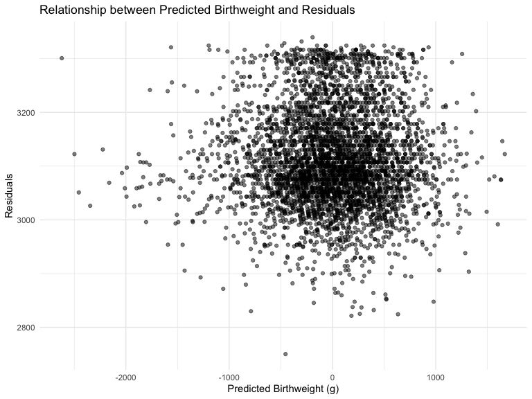

p8105\_hw6\_sg3891
================
Sandya Ganesh
2021-12-04

## Question 1

#### Load and clean the birthweight data for regression analyses.

``` r
birthweight = 
  read_csv("./data/birthweight.csv")

skimr::skim(birthweight)
```

|                                                  |             |
|:-------------------------------------------------|:------------|
| Name                                             | birthweight |
| Number of rows                                   | 4342        |
| Number of columns                                | 20          |
| \_\_\_\_\_\_\_\_\_\_\_\_\_\_\_\_\_\_\_\_\_\_\_   |             |
| Column type frequency:                           |             |
| numeric                                          | 20          |
| \_\_\_\_\_\_\_\_\_\_\_\_\_\_\_\_\_\_\_\_\_\_\_\_ |             |
| Group variables                                  | None        |

Data summary

**Variable type: numeric**

| skim\_variable | n\_missing | complete\_rate |    mean |     sd |     p0 |     p25 |     p50 |     p75 |   p100 | hist  |
|:---------------|-----------:|---------------:|--------:|-------:|-------:|--------:|--------:|--------:|-------:|:------|
| babysex        |          0 |              1 |    1.49 |   0.50 |   1.00 |    1.00 |    1.00 |    2.00 |    2.0 | ▇▁▁▁▇ |
| bhead          |          0 |              1 |   33.65 |   1.62 |  21.00 |   33.00 |   34.00 |   35.00 |   41.0 | ▁▁▆▇▁ |
| blength        |          0 |              1 |   49.75 |   2.72 |  20.00 |   48.00 |   50.00 |   51.00 |   63.0 | ▁▁▁▇▁ |
| bwt            |          0 |              1 | 3114.40 | 512.15 | 595.00 | 2807.00 | 3132.50 | 3459.00 | 4791.0 | ▁▁▇▇▁ |
| delwt          |          0 |              1 |  145.57 |  22.21 |  86.00 |  131.00 |  143.00 |  157.00 |  334.0 | ▅▇▁▁▁ |
| fincome        |          0 |              1 |   44.11 |  25.98 |   0.00 |   25.00 |   35.00 |   65.00 |   96.0 | ▃▇▅▂▃ |
| frace          |          0 |              1 |    1.66 |   0.85 |   1.00 |    1.00 |    2.00 |    2.00 |    8.0 | ▇▁▁▁▁ |
| gaweeks        |          0 |              1 |   39.43 |   3.15 |  17.70 |   38.30 |   39.90 |   41.10 |   51.3 | ▁▁▂▇▁ |
| malform        |          0 |              1 |    0.00 |   0.06 |   0.00 |    0.00 |    0.00 |    0.00 |    1.0 | ▇▁▁▁▁ |
| menarche       |          0 |              1 |   12.51 |   1.48 |   0.00 |   12.00 |   12.00 |   13.00 |   19.0 | ▁▁▂▇▁ |
| mheight        |          0 |              1 |   63.49 |   2.66 |  48.00 |   62.00 |   63.00 |   65.00 |   77.0 | ▁▁▇▂▁ |
| momage         |          0 |              1 |   20.30 |   3.88 |  12.00 |   18.00 |   20.00 |   22.00 |   44.0 | ▅▇▂▁▁ |
| mrace          |          0 |              1 |    1.63 |   0.77 |   1.00 |    1.00 |    2.00 |    2.00 |    4.0 | ▇▇▁▁▁ |
| parity         |          0 |              1 |    0.00 |   0.10 |   0.00 |    0.00 |    0.00 |    0.00 |    6.0 | ▇▁▁▁▁ |
| pnumlbw        |          0 |              1 |    0.00 |   0.00 |   0.00 |    0.00 |    0.00 |    0.00 |    0.0 | ▁▁▇▁▁ |
| pnumsga        |          0 |              1 |    0.00 |   0.00 |   0.00 |    0.00 |    0.00 |    0.00 |    0.0 | ▁▁▇▁▁ |
| ppbmi          |          0 |              1 |   21.57 |   3.18 |  13.07 |   19.53 |   21.03 |   22.91 |   46.1 | ▃▇▁▁▁ |
| ppwt           |          0 |              1 |  123.49 |  20.16 |  70.00 |  110.00 |  120.00 |  134.00 |  287.0 | ▅▇▁▁▁ |
| smoken         |          0 |              1 |    4.15 |   7.41 |   0.00 |    0.00 |    0.00 |    5.00 |   60.0 | ▇▁▁▁▁ |
| wtgain         |          0 |              1 |   22.08 |  10.94 | -46.00 |   15.00 |   22.00 |   28.00 |   89.0 | ▁▁▇▁▁ |

Looking into this data set, we can see that the total number of
observations is 4342 observations with 20 variables. The dataset
includes variables such as babysex, bhead, blength, bwt, delwt, fincome.
Additionally, all of the variables are numeric and there are no missing
values.

Next, we will convert numeric to factor variables.

``` r
birthweight = birthweight %>% 
  mutate(
    babysex = factor(babysex),
    babysex = fct_recode(babysex, "male" = '1', "female" = '2'),
    frace = factor(frace),
    frace = fct_recode(frace,
                       "White" = '1',
                       "Black" = '2',
                       "Asian" = '3',
                       "Puerto Rican" = '4',
                       "Other" = '8',
                       "Unknown" = '9'),
    malform = factor(malform),
    malform = fct_recode(malform,
                         "absent" = '0',
                         "present" = '1'),
    mrace = factor(mrace),
    mrace = fct_recode(mrace,
                       "White" = '1',
                       "Black" = '2',
                       "Asian" = '3',
                       "Puerto Rican" = '4',
                       "Other" = '8')
     )
```

Model 1: I will build my model using backwards selection, and validating
the predictors we are including using the current literature and my
hypotheses. For the backwards selection, we will start with a fully
saturated model, and then run backwards selection to remove all
non-significant predictors.

``` r
model1 = lm(bwt ~ ., data = birthweight) %>% 
  MASS::stepAIC(direction = "backward", trace = FALSE)

model1 %>% broom::tidy() %>% knitr::kable(digits = 3)
```

| term              |  estimate | std.error | statistic | p.value |
|:------------------|----------:|----------:|----------:|--------:|
| (Intercept)       | -6098.822 |   137.546 |   -44.340 |   0.000 |
| babysexfemale     |    28.558 |     8.455 |     3.378 |   0.001 |
| bhead             |   130.777 |     3.447 |    37.944 |   0.000 |
| blength           |    74.947 |     2.019 |    37.120 |   0.000 |
| delwt             |     4.107 |     0.392 |    10.475 |   0.000 |
| fincome           |     0.318 |     0.175 |     1.820 |   0.069 |
| gaweeks           |    11.592 |     1.462 |     7.929 |   0.000 |
| mheight           |     6.594 |     1.785 |     3.694 |   0.000 |
| mraceBlack        |  -138.792 |     9.907 |   -14.009 |   0.000 |
| mraceAsian        |   -74.887 |    42.315 |    -1.770 |   0.077 |
| mracePuerto Rican |  -100.678 |    19.325 |    -5.210 |   0.000 |
| parity            |    96.305 |    40.336 |     2.388 |   0.017 |
| ppwt              |    -2.676 |     0.427 |    -6.261 |   0.000 |
| smoken            |    -4.843 |     0.586 |    -8.271 |   0.000 |

Considering an alpha of 0.05 for significance, our model now contains
statistically significant predictors of baby’s birthweight, except for
fincome (family’s monthly income). To validate whether this predictor
should be included though it is not statistically significant, I looked
into the literature, and found that family income is positively
associated with baby’s birthweight, with lower incomes predicting lower
birthweights. This makes sense, as income can affect nutrition of the
mother during pregnancy and other social determinants of health.

I also looked at all of the significant predictors to ensure they are
variables used in the literature when looking at birth outcomes. Factors
relating to the mother such as maternal race and height, as well as
factors relating to the baby such as sex and length often appear in the
literature, so I feel comfortable including them. Additionally, the
literature shows that smoking during pregnancy can cause a lot of
malformations in children and can affect birthweight as well, so it
makes sense to include number of cigarettes smoked as a predictor.

Plot of model residuals against fitted values (any nonlinearity, trends,
non constant residual variance)

``` r
model1 = lm(bwt ~ menarche + fincome + smoken, data = birthweight)

model1 %>% broom::tidy() %>% knitr::kable(digits = 3)
```

| term        | estimate | std.error | statistic | p.value |
|:------------|---------:|----------:|----------:|--------:|
| (Intercept) | 3096.503 |    66.600 |    46.494 |   0.000 |
| menarche    |   -7.769 |     5.178 |    -1.500 |   0.134 |
| fincome     |    3.181 |     0.295 |    10.768 |   0.000 |
| smoken      |   -6.073 |     1.036 |    -5.862 |   0.000 |

``` r
add_residuals(birthweight, model1) %>% add_predictions(model1) %>% 
  ggplot(aes(x = resid, y = pred)) + geom_point(alpha = 0.5) +
  labs(x = "Predicted Birthweight (g)",
       y = "Residuals",
       title = "Relationship between Predicted Birthweight and Residuals")
```

<!-- -->
\#\#\#\# Additional Models and Cross Validation

Model with length at birth and gestational age as predictors

``` r
model2 = lm(bwt ~ 
              blength + gaweeks, 
              data = birthweight)
```

Model with head circumference, length, sex, and all interactions as
predictors

``` r
model3 = lm(bwt ~ 
              bhead + blength + babysex + 
              bhead * blength + bhead * babysex + blength * babysex + 
              bhead * blength * babysex, 
              data = birthweight)
```

In order to do the cross validation, we will first create the crossv\_mc
tibble with the train and test data

``` r
cv_df = crossv_mc(birthweight, 100) %>% 
  mutate(
    train = map(train, as_tibble),
    test = map(test, as_tibble)
  )
```

Next, we will fit the models and get the root mean squared errors
